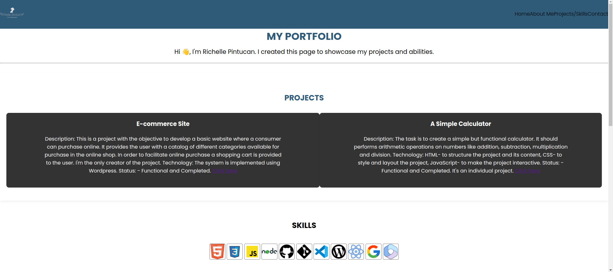
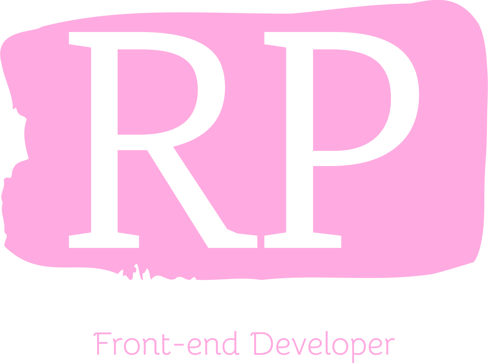

# PORTFOLIO

> A compilation of my academic and professional materials including education,
> skills, qualifications,training and experiences.

## Table of contents

- [Name of project](#portfolio)
  - [Table of contents](#table-of-contents)
  - [General info](#general-info)
  - [Screenshots](#screenshots)
  - [Technologies](#technologies)
  - [Setup](#setup)
  - [Code Examples](#code-examples)
  - [Status](#status)
  - [Contact](#contact)
  - [Instructions for use](#instructions-for-use)
  - [Code Quality Checks](#code-quality-checks)

## General info

> This is a great project to hone my skills in HTML and CSS.

## Screenshots



## Technologies

- Node v20.11.0
- VSC code, HTML/CSS
- Git
- Github

## Setup

- Use the same template
- Clone the template
- Run Npm install

## Code Examples

```html
<!-- Header -->
<header>
  <div class="container">
    <div class="logo">
      
    </div>

    <nav>
      <ul>
        <li><a href="./index.html">Home</a></li>
        <li><a href="#all-about-me">About Me</a></li>
        <li><a href="#skills-projects">Skills/Projects</a></li>
        <li><a href="./contact.html">Contact</a></li>
      </ul>
    </nav>
  </div>
  <div>
    <h1>PORTFOLIO</h1>
  </div>

  <hr class="clear" />
</header>
```

## Status

Project is: _in progress_

## Contact

By [Richelle Pintucan](https://github.com/richellepintucan)

## Instructions for use

<!-- a guide to using this repository -->

1. `git clone git@github.com:HackYourFutureBelgium/template-markdown.git`
2. `cd template-markdown`
3. `npm install`

## Code Quality Checks

- `npm run format`: Makes sure all the code in this repository is well-formatted
  (looks good).
- `npm run lint:ls`: Checks to make sure all folder and file names match the
  repository conventions.
- `npm run lint:md`: Will lint all of the Markdown files in this repository.
- `npm run lint:css`: Will lint all of the CSS files in this repository.
- `npm run validate:html`: Validates all HTML files in your project.
- `npm run spell-check`: Goes through all the files in this repository looking
  for words it doesn't recognize. Just because it says something is a mistake
  doesn't mean it is! It doesn't know every word in the world. You can add new
  correct words to the [./.cspell.json](./.cspell.json) file so they won't cause
  an error.
